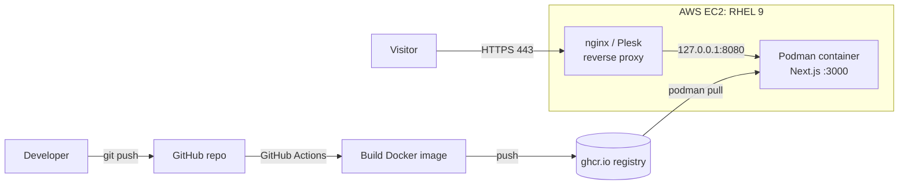

# Next.js App: Containerized & Deployed on AWS with Podman, Plesk and CI/CD

A Next.js application packaged as a production Docker image, built automatically with **GitHub Actions**, published to **GitHub Container Registry (GHCR)**, and served on an **AWS EC2 (Red Hat Enterprise Linux 9)** server using **Podman** behind an **nginx reverse proxy managed by Plesk**.

**Live site:** https://shanoop.in

---

## What this project demonstrates

- Containerizing a Next.js app with a **multi-stage Dockerfile**
- A **CI/CD pipeline**: every push to `main` builds and publishes a new image
- Deploying on **AWS EC2** with **Podman** (RHEL's native, daemonless container engine)
- Putting containers behind **nginx / Plesk** as a reverse proxy
- **TLS certificates** with Let's Encrypt
- Linux server administration: SELinux, firewall, swap, systemd, security groups
- Troubleshooting a low-memory server in production

---

## Architecture



**Request flow:** Browser → AWS Security Group (80/443) → nginx (Plesk) → `127.0.0.1:8080` → Podman container → Next.js on port 3000.
The container port is bound to localhost only, so the app is never exposed directly to the internet.

---

## Tech stack

| Layer | Technology |
|---|---|
| Framework | Next.js (React, TypeScript) |
| Container | Docker image, run with Podman |
| CI/CD | GitHub Actions, GitHub Container Registry |
| Cloud | AWS EC2, Security Groups |
| OS | Red Hat Enterprise Linux 9 |
| Web server | nginx (via Plesk Obsidian) |
| TLS | Let's Encrypt |

---

## Repository structure

```
.
├── app/                       # Next.js app (App Router)
├── public/                    # Static assets
├── Dockerfile                 # Production multi-stage build
├── Dockerfile.dev             # Development image (hot reload)
├── docker-compose.yml         # Local development setup
├── .dockerignore
├── .github/workflows/
│   └── docker-build.yml       # CI: build & push image to GHCR
└── package.json
```

---

## Run locally

**With Node.js**

```bash
npm install
npm run dev
# open http://localhost:3000
```

**With Docker (development)**

```bash
docker compose up --build
```

**With Docker (production image)**

```bash
docker build -t nextjs-app .
docker run -p 3000:3000 nextjs-app
```

---

## CI/CD pipeline

The workflow in `.github/workflows/docker-build.yml`:

1. Triggers on every push to `main` (or manually)
2. Logs in to GHCR with the built-in `GITHUB_TOKEN`
3. Builds the image with Docker Buildx (with layer caching)
4. Pushes two tags: `latest` and the commit SHA

Image: `ghcr.io/shanoopthikkodi19/nextjs-app:latest`

---

## Deployment (EC2 + Podman + Plesk)

**1. Pull and run the container (bound to localhost)**

```bash
sudo podman pull ghcr.io/shanoopthikkodi19/nextjs-app:latest

sudo podman run -d --name nextjs-app \
  -p 127.0.0.1:8080:3000 \
  --restart=always \
  ghcr.io/shanoopthikkodi19/nextjs-app:latest

sudo systemctl enable podman-restart.service   # restart containers on boot
```

**2. Allow nginx to reach the container (SELinux)**

```bash
sudo setsebool -P httpd_can_network_connect 1
```

**3. Reverse proxy in Plesk** (*Apache & nginx Settings → Additional nginx directives*)

```nginx
location ~ ^/(?!\.well-known/acme-challenge/) {
    proxy_pass http://127.0.0.1:8080;
    proxy_http_version 1.1;
    proxy_set_header Host $host;
    proxy_set_header X-Real-IP $remote_addr;
    proxy_set_header X-Forwarded-For $proxy_add_x_forwarded_for;
    proxy_set_header X-Forwarded-Proto $scheme;
}
```

The negative lookahead keeps `/.well-known/acme-challenge/` available to Plesk so Let's Encrypt validation and renewal work.

**4. HTTPS certificate**

```bash
sudo plesk bin extension --exec letsencrypt cli.php -d shanoop.in -m <your-email>
```

**5. Update the site after a new release**

```bash
sudo podman pull ghcr.io/shanoopthikkodi19/nextjs-app:latest
sudo podman rm -f nextjs-app
sudo podman run -d --name nextjs-app -p 127.0.0.1:8080:3000 --restart=always \
  ghcr.io/shanoopthikkodi19/nextjs-app:latest
```

---

## Problems solved along the way

| Problem | Cause | Solution |
|---|---|---|
| Plesk Docker extension would not install | RHEL's `container-tools` (Podman) conflicts with Docker | Chose Podman and a manual reverse proxy instead of the Docker extension |
| Server froze during `next build` | ~700 MB RAM, Plesk already using most of it | Added swap and moved the build to GitHub Actions so the server only runs the finished image |
| `duplicate location "/"` nginx error | Plesk already generates `location /` for each domain | Used a regex location that does not collide with Plesk's block |
| Let's Encrypt validation returned 404 | Proxy rule sent `/.well-known/acme-challenge/` to the app | Excluded the challenge path from the proxy rule |
| DNS lookups and package installs failed | Outbound security group rules allowed only port 443 | Restored the default allow-all outbound rule |
| Public IP changed after instance stop/start |  Elastic IP attached | Elastic IP attached |

---

## Security notes

- Container port is bound to `127.0.0.1` only, so nginx is the sole public entry point
- Inbound security group: 80/443 public; SSH and admin panel restricted to trusted IPs
- Secrets are never committed. Use environment variables or `--env-file` on the server
- Images are built in CI from source, not on the production server

---

## Possible improvements

- Auto-deploy to the server after each successful build (SSH step or webhook)
- Health checks and uptime monitoring
- Run the container as a non-root user and use Podman Quadlet/systemd units
- Move to a larger instance or a managed service (ECS/Fargate) for production workloads
- Add automated tests and a lint step to the pipeline

---

## Author

**Shanoop Thikkodi**
GitHub: [@shanoopthikkodi19](https://github.com/shanoopthikkodi19)

Available for DevOps, deployment and web development work. Feel free to reach out.
